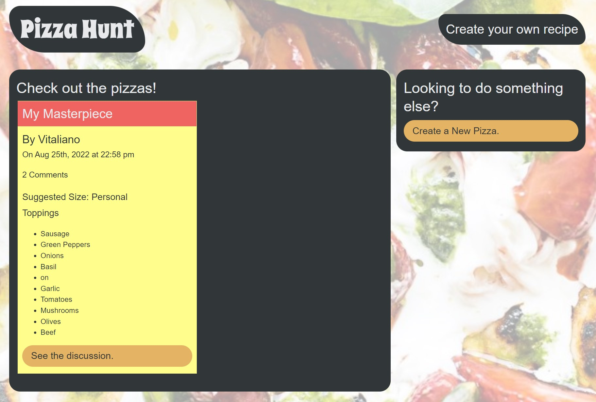
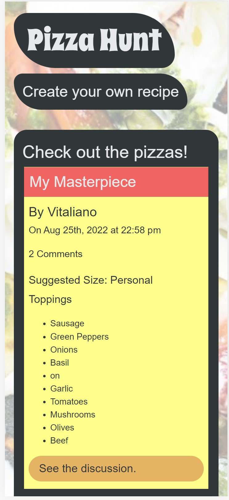

# Note Taker

## This is a web application for a user to view pizza recipies that others have posted, they can write and save thier own pizza recipies and comment on others. The app is located on Heroku at [https://pizza-hunt-gdw.herokuapp.com/](https://pizza-hunt-gdw.herokuapp.com/).

## Table of Contents:

- [Installation](#installation)
- [Usage](#usage)
- [Screenshots](#screenshots)
- [License](#license)
- [Collaborators](#collaborators)
- [Contributing](#contributing)
- [Testing](#tests)
- [Questions](#questions)

## Installation

Clone the repository from [GitHub](https://github.com/willig0203/pizza-hunt) onto your machine in a local folder if yoy want to run it locally.

## Usage

Step one: From the terminal in vsCode type `npm install`.
Step two: Enter `node server.js` to start the server.
Step three: Enter localhost:3001 in your browser.

OR

Use the live app on Heroku: [https://pizza-hunt-gdw.herokuapp.com/](https://pizza-hunt-gdw.herokuapp.com/)

## Screenshots

|        <b>Image running on a computer</b>        |
| :----------------------------------------------: |
|  |

|       <b>Image running on a mobile device</b>       |
| :-------------------------------------------------: |
|  |

## License

&copy; 2022 by Gary Williams (Trademark GarywareLLC).
This project is licensed under the MIT license.
https://opensource.org/licenses/MIT

## Collaborators:

Gary Williams

## Contributing

None at this time.

## Tests

None at this time.

## Questions

Contact Gary Williams at: [willig0203@gmail.com](mailto:willig0203@gmail.com)
